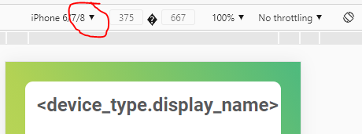

# Twomes Measurement Device Installation Manual

The index.html in this folder can be used as the template for the manuals with installation intructions for a specific measurement device. These manuals are presented in the Twomes WarmteWachter app to help subjects of the Twomes Research Project to physically install and power up a specific measurement device.

Below you can find the following:
* [Writing content using the template](#writing-content-using-the-template)
* [Previewing](#previewing)
* [Deploying](#deploying)

## Writing content using the template
To use this template you only need a webbrowser and a plain text editor (or your favorite IDE).
Clone this repository our just download the contents of this folder. Change`index.html` to fit the need of your measurement device. Be sure to write in the the language of your intended audience. Do not change the existing styles in the stylesheet; doing so would ruin consistency with the visual style of installation manuals of other devices. Instead, add additional stylerules for any custom styling that is required.

The default styles are:

* `div.video-block` with predefined styling for (embedded videos).
* `div.image-block` with predefined styling for images.
* `div.text-block` with predefined styling for texts.

### Previewing
Open the file `preview.html` to preview your manual as shown in the WarmteWachter app. Do not change the content of `preview.html`. To make the preview resemble the size and aspect ratio of a smartphone screen:

1. Press the `Ctrl + Shift + I` keys (or `F12` ) on your keyboard to access the Developer Tools 
2. Press the `Ctrl + Shift + M` keys on to enter (mobile) device emulation mode
3. By default, you are in 'Responsive' mode. Using the dropdown menu (above the preview), you can also select custom dimensions for specific devices, such as the iPhone 6/7/8.


## Deploying
Upload the manuals to the server to make them available in the Twomes app. This involved all files in the `manual` folder of your device: not only the the `index.html`, but also all resources referred to in this file, such as images.

For the WarmteWachter app, files must be uploaded to `https://energietransitiewindesheim.nl/manuals/<device_type.name>/`. 
You cannot upload the manuals to the `energietransitiewindeshome.nl` domain yourself. Instead, you shuold request @hterhofte to do this, by creating a pull request and requeting upload to the server explicitly. After uploading, the Warmtewachter app can display the installation manual. Example: the installation manual for the `Generic-Test` device type is available at:
```
 https://energietransitiewindesheim.nl/manuals/Generic-Test/
```
