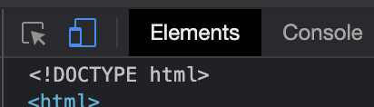

# Twomes Measurement Device Manual

The index.html in this folder can be used as the template for the manuals with installation intructions for a given measurement device. These manuals are presented in the Twomes WarmteWacher app to help subjects of the Twomes Research Project to install the corresponding measurement device.

Below you can find the following
 - [Using the template](#using-the-template)
    - [Previewing](#previewing)
 - [Deployment](#deployment)

## Using the template
Essentially all that is needed for using this template is a Webbrowser and any plain text editor (or your favorite IDE).
Clone this repository our just download the contents of this folder. Apply any changes to fit the need of your measurement device. For consistency reasons try to refrain from updating the existing stylesheet. Instead add additional stylerules for any custom styling that is required.

Out of the box we offer;
 - `div.video-block` with predefined styling for (embedded videos).
 - `div.image-block` with predefined styling for images.
 - `div.text-block` with predefined styling for texts.

### Previewing
In this same folder there is a `preview.html`, opening this in your webbrowser will present the manual as it would in the WarmteWachter app. Most browsers have a responsive design modus, usually you can open this with the `F12` key.

Example for Google Chrome users. Either use the `F12` key or `Ctrl+Shift+I` to open the developer tools.
Then at the top left of the developer tools, the second icon can be used to enter 'Responsive design modus'.

Additionally above the viewport you can set custom dimensions or using the available dropdown selecting any predefined devices such as the Google Pixel or iPhone.

## Deployment
The manuals need to be uploaded to the server to make them available for usage by the WarmteWachter app.

The path for this is;
```
https://energietransitiewindesheim.nl/manuals/<device_display_name>/
// Generic-Test: https://energietransitiewindesheim.nl/manuals/Generic-Test/
```

When uploading your manual to the server create a folder using the device display name and inside it place the `index.html` file and any of the resouces used by it.